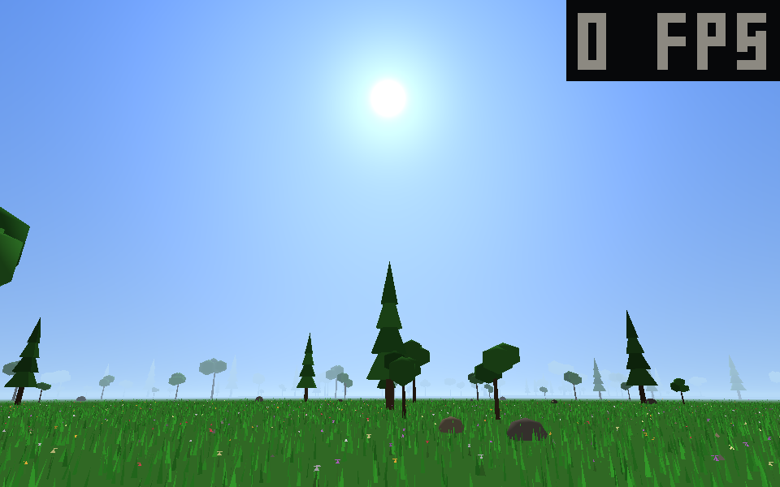
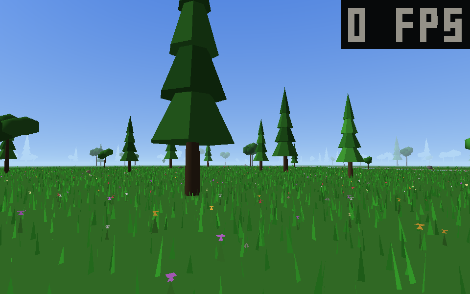
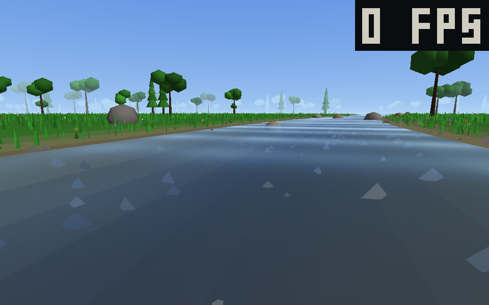
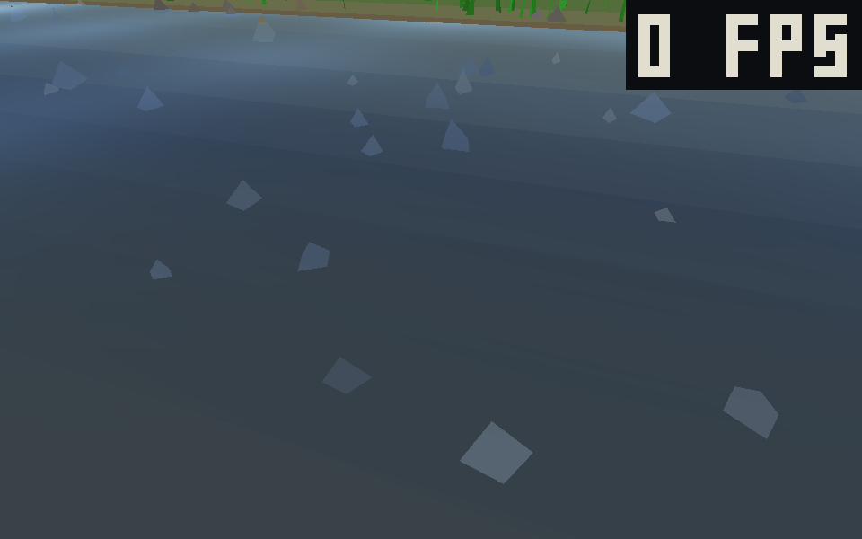
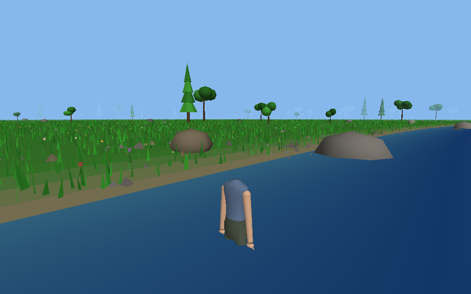

# fp-meadow · 第一人称草地

一个用 **C++ 和 Direct3D 11 从零写的**第一人称小游戏：没有引擎、没有第三方库、没有任何模型贴图资源，
整个游戏只有一个 `src/main.cpp`。走在一片会一直延伸下去的草地上，有河、有花、有树、有太阳，
低头能看见自己的身子。



## 有什么

- **第一人称**：WASD 走、鼠标转视角、空格跳。低头能看见自己的胸、两条垂在身体两侧的胳膊和两条腿；
  跳起来整个人连腿一起离地、膝盖收起来；站在水里腿会被水盖住一层颜色。
- **无限地图**：玩家周围一圈的地面/草/花/树是一个"窗口"，走到哪生成到哪（分帧攒 + 双缓冲换缓冲），
  走多远都不会看到地图的边，地平线化进雾里。
- **河**：真凹下去的河道（河心比岸低 1.15 米），水面比岸低 0.32 米；水是半透明的、能看见河床的沙和石头，
  有菲涅尔反光和太阳的碎光 —— 平视像镜子，低头能看穿。
- **花和树**：5 种颜色的花；三种树（圆冠阔叶 / 尖顶松树 / 小树），最高的十几米，树干有碰撞箱，撞上去会被推开。
- **石头和石子**：越靠河越多，河滩上是一层石子，水底下也撒着。
- **天空和太阳**：天顶深蓝到地平线发白的渐变，太阳是 1.2 度的亮盘 + 三层光晕，全部由像素着色器算出来。
- **地形**：河床 / 岸坡 / 平地三级高度，人和草、花、石头都跟着地面高低走。






## 操作

| 键 | 作用 |
| --- | --- |
| 鼠标 | 转视角 |
| W A S D | 前后左右走 |
| 空格 | 跳（落地才能再跳） |
| ESC | 退出 |

右上角是帧率，窗口标题里是当前这一版世界的顶点数和地图中心。

## 怎么编译

需要 Windows 10/11 + Visual Studio 2019/2022（安装时勾上"使用 C++ 的桌面开发"）。

最简单：双击 `build.bat`。

命令行（"x64 Native Tools Command Prompt for VS"里）：

```bat
cl /nologo /utf-8 /O2 /MT /W3 /EHsc /D_CRT_SECURE_NO_WARNINGS /Fe:fp.exe /Fo:build\ ^
   src\main.cpp user32.lib gdi32.lib d3d11.lib dxgi.lib d3dcompiler.lib
```

`build_release.bat` 会用静态链接的 CRT（`/MT`）编译，再打成一个可以直接发给别人的 zip ——
拿到的人不用装 VC++ 运行库，解压双击就能玩。

## 直接玩

到 [Releases](../../releases) 下载 `fp-meadow-v1.0.0-win64.zip`，解压后双击 `fp.exe`。
（Windows 可能提示"Windows 已保护你的电脑"，点"更多信息 → 仍要运行"。）

## 代码结构

```
src/main.cpp        全部代码：顶点怎么攒、着色器、世界生成、碰撞、渲染循环
build.bat           给人用的编译脚本（结束会 pause）
build_release.bat   编译 + 打包成发布用的 zip
tools/              调试小工具：TGA 转 PNG、性能计时、对齐截图、崩溃 dump 解析
docs/               README 里的截图
```

想调的时候有一些调试参数（`src/main.cpp` 顶部的注释里有完整列表）：

```bat
fp.exe --shot out.tga        跑一帧、直接把后备缓冲写成图（不用人看屏幕）
fp.exe --self 3              从外面 3 米处看自己这副身子
fp.exe --walk 900            自动往前走 900 帧（测无限地图边走边重攒）
fp.exe --px 300 --pz -480    一开始就站在世界坐标 (300,-480)
fp.exe --seed 7              地图（那条河）用固定种子，前后截图能对上
fp.exe --log out.txt         把世界顶点数、地图中心、平均帧时间写下来
```

## 一点实现说明

- **渲染**：一台 D3D11 设备 + 两个着色器（一个画世界/身子/UI，一个画天空）。
  几何体全部在 CPU 上按帧攒成三角形，世界一次 `Draw` 画完，水面因为要半透明单独一遍。
- **世界是坐标的纯函数**：草、花、树、石头的位置都由"格子坐标 → 哈希 → 随机数"算出来，
  所以重新生成一遍，东西还长在原来的地方，不会"长腿"；树的位置和碰撞箱用的是同一个函数，永远对得上。
- **没有资源文件**：画面里每一个三角形、每一朵花、每一棵树都是代码算出来的，
  仓库里除了源码就是几张截图。

## 协议

MIT，见 [LICENSE](LICENSE)。

## English summary

A first-person game written from scratch in one C++ file with Direct3D 11 — no engine, no libraries,
no model or texture assets. An infinite procedural meadow with a river (real depth, clear water,
Fresnel reflections), wild flowers, tall trees with collision, stones, and a shader-drawn sun and sky.

Controls: mouse to look, `WASD` to move, `Space` to jump, `ESC` to quit. Build with MSVC via `build.bat`,
or grab a prebuilt `fp.exe` from the Releases page. MIT licensed.
